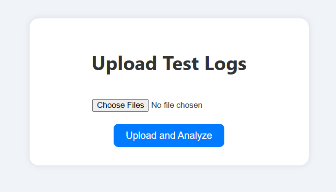
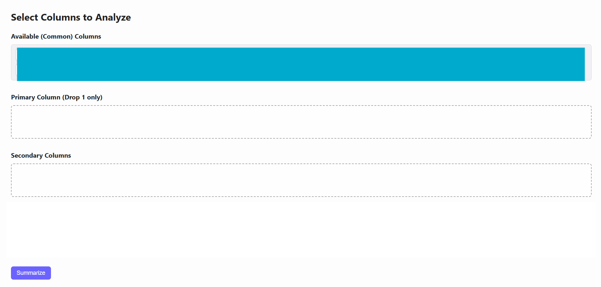

# 🚀 Log Summary & Analysis Tool

This is a production-ready AI-powered tool for summarizing and comparing tabular logs across multiple files (Excel, CSV, PDF). Designed for fast local use, it supports both **file uploads** and **entire folders (ZIPs)** and outputs intelligent summaries along with downloadable Excel reports.

## 🔍 Key Features

- 🧠 **AI-Based Summary** using FLAN-T5  
- 🧾 Handles **Excel, CSV, PDF** formats  
- 📂 Accepts **ZIP folders** with multiple logs  
- 🧮 Smart grouping of **primary + secondary columns**  
- 🎨 Color-coded groups with **legend support**  
- 📊 Generates **comparison tables across files**  
- 📥 One-click **Excel export** with multiple sheets  
- ⚙️ Built using **Flask**, **Transformers**, **Pandas**

## 📸 Screenshots

### 🗂 Upload & File Parsing  


### 🧠 Drag and Drop


## 🏗 Tech Stack

| Layer         | Tools/Packages                                                                 |
|---------------|----------------------------------------------------------------------------------|
| Frontend      | HTML, CSS (custom), Flask Templates                                             |
| Backend       | Flask, Pandas, XlsxWriter, pdfplumber                                           |
| AI/NLP        | HuggingFace Transformers, FLAN-T5, SentenceTransformers                         |
| File Support  | `.xlsx`, `.xls`, `.csv`, `.pdf`, `.zip`                                         |
| Export Format | `.xlsx` with multiple sheets                                                    |

## ⚙️ Setup Instructions

### 🔧 1. Install Dependencies

```bash
pip install -r requirements.txt

### 📁 2. Folder Structure

project/
├── app.py
├── templates/
├── static/
│   ├── styles.css
│   ├── demo_upload.png
│   ├── demo_columns.png
│   ├── demo_summary.png
│   └── demo_excel.png
├── uploads/
├── requirements.txt
├── README.md


## 🚀 3. Run the App

```bash
python app.py
```

Visit [http://127.0.0.1:5000](http://127.0.0.1:5000) in your browser.

---

## 📥 Excel Export Details

When you click **Download**, the Excel file will contain:

- **Sheet 1**: `Supporting Summary Table`
- **Sheet 2**: `Comparison Across Files`
- **Sheet 3+**: Raw data from each uploaded file  
  *(Each sheet is named after the original filename)*

---

## 🧠 AI Model Info

- 🔍 **Model Used**: `google/flan-t5-large`
- 🔗 Powered by **Hugging Face Transformers**
- 🧠 Embedded logic for summarizing patterns, relationships, and grouping insights

---

## 🧹 Reset / Cleanup

To reset session and delete uploaded files:

[http://127.0.0.1:5000/reset](http://127.0.0.1:5000/reset)

---

## 🤝 Contributing

Open to suggestions and pull requests.  
This tool was built to assist in internal **audit and QA log analysis**, but can be adapted for any structured tabular summarization use case.

---

## 📃 License

MIT License — free to use, distribute, and modify.
